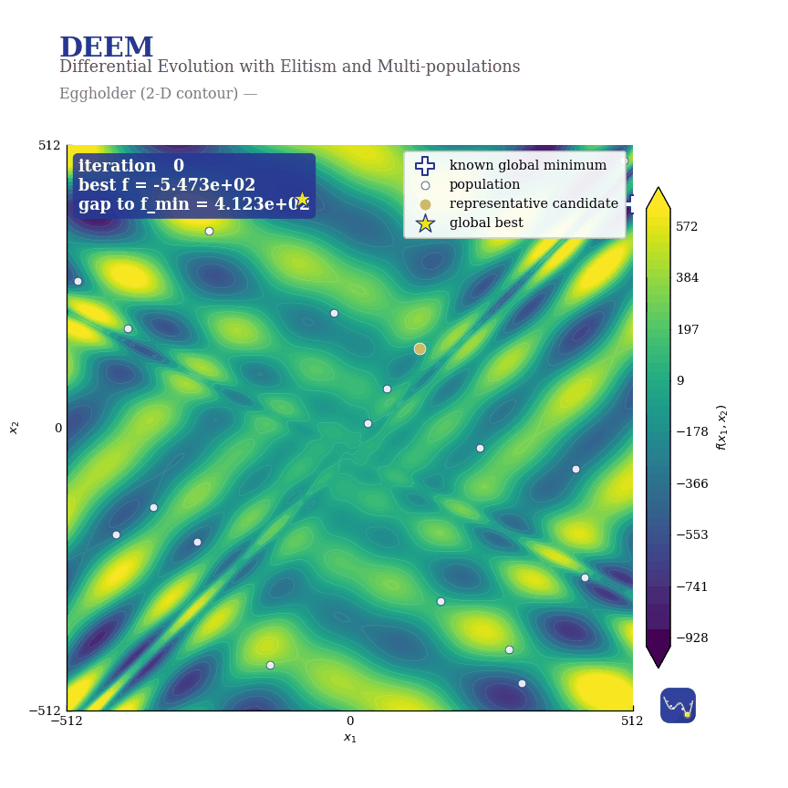
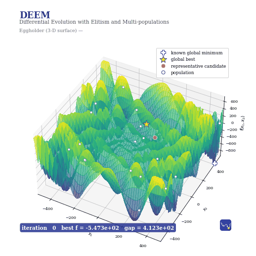

# Visualising convergence (2-D and 3-D)

This example runs DEEMI on the 2-D Eggholder landscape and renders the optimisation
two ways: a **2-D contour** view and a **3-D surface** view in which the elevation is
the objective value \(f(x_1, x_2)\). Both show the population of candidate solutions
moving each iteration and the running global best descending to the global minimum at
the origin; the global best and one ordinary candidate are identified in a legend.

## 2-D contour view

{ width=620 }

## 3-D surface view (elevation = objective value)

{ width=620 }

## The script

```python
#!/usr/bin/env python3
"""
DEEMI on the Rastrigin function — animated in 2-D and 3-D.

Runs DEEMI (default settings, fixed seed) on the 2-D Rastrigin landscape and
renders two animations of the optimisation:

  * a 2-D contour view  -> deemi_rastrigin_2d.gif / .mp4
  * a 3-D surface view  -> deemi_rastrigin_3d.gif / .mp4   (function value as the
                                                            z-axis elevation)

Each animation shows the objective landscape, the population of candidate
solutions as they move each iteration, the running global best with its trajectory
to the global minimum at the origin, and one highlighted ordinary candidate. The
global best and the ordinary candidate are identified in a legend.

The .gif files are convenient to embed in documentation; the .mp4 files are
1080-square H.264 videos suited to a social-media post.

Run from the repository root:

    python examples/deemi_animation.py

Requires matplotlib; the MP4 export additionally requires ffmpeg (the script
falls back to GIF-only if ffmpeg is unavailable).
"""

import io
import os
import sys
import contextlib
import numpy as np

import matplotlib
matplotlib.use("Agg")
import matplotlib.pyplot as plt
from matplotlib import animation
from matplotlib.lines import Line2D
from matplotlib.offsetbox import OffsetImage, AnnotationBbox

try:
    from DEEM.DEEMI import DEEM
except ModuleNotFoundError:
    sys.path.insert(0, os.path.dirname(os.path.dirname(os.path.abspath(__file__))))
    from DEEM.DEEMI import DEEM


BOUND = 5.12
SEED = 42
INDIGO = "#3f51b5"
INDIGO_DARK = "#283593"
GOLD = "#ffb300"
CORAL = "#ff5252"
HERE = os.path.dirname(os.path.abspath(__file__))


def rastrigin_scalar(x):
    x = np.asarray(x, dtype=float)
    return float(10.0 * x.size + np.sum(x * x - 10.0 * np.cos(2.0 * np.pi * x)))


def rastrigin_grid(X, Y):
    return (20.0
            + (X * X - 10.0 * np.cos(2.0 * np.pi * X))
            + (Y * Y - 10.0 * np.cos(2.0 * np.pi * Y)))


# --------------------------------------------------------------------------- #
#  DEEMI subclass that records the population after every iteration            #
# --------------------------------------------------------------------------- #
class RecordingDEEM(DEEM):
    """Records (iter, positions[sorted by fitness], global_best, f_best) per step."""

    def __init__(self, *args, **kwargs):
        self.frames = []
        super().__init__(*args, **kwargs)

    def update_archive(self):
        super().update_archive()
        P = np.array([cs.x.copy() for cs in self.candidates])
        mid = len(self.candidates) // 2          # a representative ordinary member
        self.frames.append({
            "it": int(self.iters),
            "P": P,
            "best": self.XBEST.copy(),
            "fbest": float(self.FBEST),
            "ordinary": P[mid].copy(),
        })


def run_recorded(nparticles=40, maxiter=70):
    LB = np.full(2, -BOUND)
    UB = np.full(2, BOUND)
    opt = RecordingDEEM(
        function=rastrigin_scalar,
        lower_bound=LB, upper_bound=UB,
        nparticles_max=nparticles, nparticles_min=nparticles,
        npop_max=8, npop_min=4,
        maxiter=maxiter,
        seed=SEED,
    )
    with contextlib.redirect_stdout(io.StringIO()):
        opt.update()
    return opt.frames


def add_badge(fig, xy=(0.86, 0.86), zoom=0.42):
    """Place the brand badge inside the figure with clear margin (not glued)."""
    badge = os.path.join(HERE, "deem-mark-badge.png")
    if os.path.exists(badge):
        ab = AnnotationBbox(OffsetImage(plt.imread(badge), zoom=zoom), xy,
                            xycoords="figure fraction", frameon=False, zorder=10)
        fig.add_artist(ab)


def header(fig, subtitle):
    """A padded title block that is not glued to the top frame."""
    fig.suptitle("DEEM", x=0.075, y=0.955, ha="left",
                 fontsize=18, fontweight="bold", color=INDIGO_DARK)
    fig.text(0.075, 0.908, "Differential Evolution with Elitism and Multi-populations",
             ha="left", fontsize=10.5, color="#555555")
    fig.text(0.075, 0.875, subtitle, ha="left", fontsize=10, color="#777777")


def make_trails(frames):
    trails, acc = [], []
    for fr in frames:
        xb = fr["best"]
        if not acc or not np.allclose(acc[-1], xb):
            acc.append(xb)
        trails.append(np.array(acc))
    return trails


# --------------------------------------------------------------------------- #
#  2-D contour animation                                                       #
# --------------------------------------------------------------------------- #
def build_2d(frames, hold=12):
    g = np.linspace(-BOUND, BOUND, 400)
    X, Y = np.meshgrid(g, g)
    Z = rastrigin_grid(X, Y)
    trails = make_trails(frames)
    order = list(range(len(frames))) + [len(frames) - 1] * hold

    fig, ax = plt.subplots(figsize=(7.2, 7.2))
    fig.subplots_adjust(left=0.085, right=0.97, top=0.83, bottom=0.075)
    ax.contourf(X, Y, Z, levels=40, cmap="viridis")
    ax.contour(X, Y, Z, levels=12, colors="white", linewidths=0.25, alpha=0.3)

    gmin = ax.plot(0, 0, marker="P", color="white", markersize=11,
                   markeredgecolor=INDIGO_DARK, markeredgewidth=1.2,
                   linestyle="None", zorder=4, label="global minimum")[0]
    pop = ax.scatter([], [], s=30, facecolor="white", edgecolor=INDIGO_DARK,
                     linewidth=0.6, alpha=0.85, zorder=3, label="population")
    ordc, = ax.plot([], [], marker="o", color=CORAL, markersize=11,
                    markeredgecolor="white", markeredgewidth=1.0,
                    linestyle="None", zorder=5, label="ordinary candidate")
    best, = ax.plot([], [], marker="*", color=GOLD, markersize=20,
                    markeredgecolor=INDIGO_DARK, markeredgewidth=0.9,
                    linestyle="None", zorder=6, label="global best")
    trail, = ax.plot([], [], color=GOLD, linewidth=1.4, alpha=0.85, zorder=4)

    ax.set_xlim(-BOUND, BOUND); ax.set_ylim(-BOUND, BOUND)
    ax.set_xticks([-5, 0, 5]); ax.set_yticks([-5, 0, 5])
    ax.set_xlabel("$x_1$"); ax.set_ylabel("$x_2$")
    ax.set_aspect("equal")
    ax.legend(loc="upper right", framealpha=0.9, fontsize=9, borderpad=0.6)
    hud = ax.text(0.02, 0.975, "", transform=ax.transAxes, va="top", ha="left",
                  fontsize=11, color="white", fontweight="bold",
                  bbox=dict(boxstyle="round,pad=0.35", fc=INDIGO_DARK, ec="none", alpha=0.85))

    header(fig, "Rastrigin (2-D) — population converging to the global minimum")
    add_badge(fig, xy=(0.88, 0.10), zoom=0.40)

    def update(fi):
        fr = frames[order[fi]]
        pop.set_offsets(fr["P"])
        ordc.set_data([fr["ordinary"][0]], [fr["ordinary"][1]])
        best.set_data([fr["best"][0]], [fr["best"][1]])
        bp = trails[order[fi]]
        trail.set_data(bp[:, 0], bp[:, 1])
        hud.set_text(f"iteration {fr['it']:>3d}\nbest f = {fr['fbest']:.3e}")
        return pop, ordc, best, trail, hud

    anim = animation.FuncAnimation(fig, update, frames=len(order), interval=80, blit=False)
    return fig, anim


# --------------------------------------------------------------------------- #
#  3-D surface animation (function value as elevation)                         #
# --------------------------------------------------------------------------- #
def build_3d(frames, hold=12):
    g = np.linspace(-BOUND, BOUND, 140)
    X, Y = np.meshgrid(g, g)
    Z = rastrigin_grid(X, Y)
    trails = make_trails(frames)
    order = list(range(len(frames))) + [len(frames) - 1] * hold
    zlift = 2.0                                  # lift markers just above the surface

    fig = plt.figure(figsize=(7.2, 7.2))
    ax = fig.add_subplot(111, projection="3d")
    ax.computed_zorder = False                   # respect zorder so markers sit on top
    fig.subplots_adjust(left=0.0, right=1.0, top=0.82, bottom=0.02)
    ax.plot_surface(X, Y, Z, cmap="viridis", alpha=0.9, linewidth=0,
                    antialiased=False, rcount=70, ccount=70, zorder=1)

    def zof(P):
        return np.array([rastrigin_grid(np.array(p[0]), np.array(p[1])) for p in P]) + zlift

    pop = ax.scatter([], [], [], s=22, color="white", edgecolor=INDIGO_DARK,
                     linewidth=0.4, depthshade=False, zorder=5, label="population")
    ordc = ax.scatter([], [], [], s=80, color=CORAL, edgecolor="white",
                      linewidth=1.0, depthshade=False, zorder=6, label="ordinary candidate")
    best = ax.scatter([], [], [], s=240, color=GOLD, marker="*", edgecolor=INDIGO_DARK,
                      linewidth=0.7, depthshade=False, zorder=7, label="global best")
    trail, = ax.plot([], [], [], color=GOLD, linewidth=1.8, alpha=0.9, zorder=6)

    ax.set_xlim(-BOUND, BOUND); ax.set_ylim(-BOUND, BOUND)
    ax.set_xlabel("$x_1$"); ax.set_ylabel("$x_2$")
    ax.set_zlabel("$f(x_1, x_2)$")
    ax.set_box_aspect((1, 1, 0.6))

    legend_handles = [
        Line2D([0], [0], marker="*", color="none", markerfacecolor=GOLD,
               markeredgecolor=INDIGO_DARK, markersize=15, label="global best"),
        Line2D([0], [0], marker="o", color="none", markerfacecolor=CORAL,
               markeredgecolor="white", markersize=10, label="ordinary candidate"),
        Line2D([0], [0], marker="o", color="none", markerfacecolor="white",
               markeredgecolor=INDIGO_DARK, markersize=8, label="population"),
    ]
    ax.legend(handles=legend_handles, loc="upper right", fontsize=9,
              framealpha=0.9, borderpad=0.6)
    hud = fig.text(0.085, 0.10, "", va="bottom", ha="left", fontsize=11,
                   color="white", fontweight="bold",
                   bbox=dict(boxstyle="round,pad=0.35", fc=INDIGO_DARK, ec="none", alpha=0.85))

    header(fig, "Rastrigin (3-D) — elevation is the objective value $f(x_1, x_2)$")
    add_badge(fig, xy=(0.88, 0.12), zoom=0.40)

    def update(fi):
        fr = frames[order[fi]]
        P = fr["P"]
        pop._offsets3d = (P[:, 0], P[:, 1], zof(P))
        ob = fr["ordinary"]
        ordc._offsets3d = ([ob[0]], [ob[1]], [rastrigin_grid(np.array(ob[0]), np.array(ob[1])) + zlift])
        xb = fr["best"]
        best._offsets3d = ([xb[0]], [xb[1]], [rastrigin_grid(np.array(xb[0]), np.array(xb[1])) + zlift])
        bp = trails[order[fi]]
        bz = np.array([rastrigin_grid(np.array(p[0]), np.array(p[1])) for p in bp]) + zlift
        trail.set_data(bp[:, 0], bp[:, 1])
        trail.set_3d_properties(bz)
        ax.view_init(elev=42, azim=-60 + 80 * fi / max(1, len(order) - 1))   # gentle orbit
        hud.set_text(f"iteration {fr['it']:>3d}   best f = {fr['fbest']:.3e}")
        return pop, ordc, best, trail, hud

    anim = animation.FuncAnimation(fig, update, frames=len(order), interval=80, blit=False)
    return fig, anim


# --------------------------------------------------------------------------- #
def export(fig, anim, stem, gif_fps=12, mp4_fps=20, gif_dpi=88, mp4_dpi=150):
    gif = os.path.join(HERE, stem + ".gif")
    anim.save(gif, writer=animation.PillowWriter(fps=gif_fps), dpi=gif_dpi)
    print("wrote", gif)
    mp4 = os.path.join(HERE, stem + ".mp4")
    try:
        anim.save(mp4, writer=animation.FFMpegWriter(fps=mp4_fps, bitrate=3600), dpi=mp4_dpi)
        print("wrote", mp4)
    except Exception as exc:
        print(f"MP4 export skipped (ffmpeg unavailable?): {exc}")
    plt.close(fig)


def main():
    frames = run_recorded()
    print(f"recorded {len(frames)} iterations; final best f = {frames[-1]['fbest']:.3e}")

    fig2, anim2 = build_2d(frames)
    export(fig2, anim2, "deemi_rastrigin_2d")

    fig3, anim3 = build_3d(frames)
    export(fig3, anim3, "deemi_rastrigin_3d", gif_dpi=72)


if __name__ == "__main__":
    main()
```

## Running it

```bash
python examples/deemi_animation.py
```

The animation needs matplotlib; the MP4 export additionally needs ffmpeg (the script
falls back to GIF-only if ffmpeg is unavailable). The brand badge inset is optional —
the script skips it if `deem-mark-badge.png` is not next to it.
